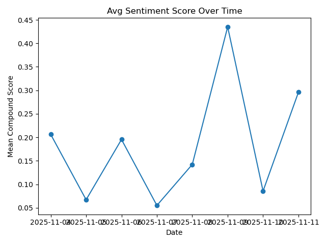
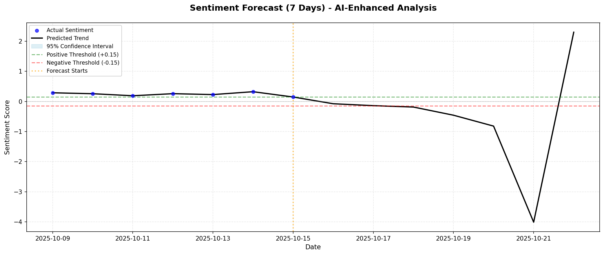

# 🚀 AI News Market Sentiment Project

## 🌟 Project Overview

This project is a unique, multi-task pipeline and dashboard for market news sentiment extraction, analytics, and forecasting.  
It brings together **news APIs, sentiment NLP (VADER/TextBlob), Slack alerts, ML forecasting (Prophet), and interactive dashboards (Streamlit OR Flask)** for a truly modern data product.  
The system operates end-to-end, fetching and analyzing news, alerting teams, forecasting trends, and visualizing results in a beautiful dashboard.

---

## 🧩 Tasks Breakdown

### **Task 1: Data Fetching, Cleaning, Sentiment Analysis & Visualization**

#### **Problem Statement**
Markets and teams need real-time insights from rapidly shifting news.  
But extracting true market mood from headlines is noisy and scattered.

#### **Approach**
- Fetch latest articles from NewsAPI and GNews for broad coverage.
- Cleaned, deduplicated, and normalized text for sentiment analysis.
- Analyzed with NLTK VADER (or TextBlob) for robust sentiment scoring and labeling.
- Visualized via three core plots:
    - **Word Cloud** – reveals dominant themes in headlines.
    - **Sentiment Counts Bar Chart** – shows distribution of market optimism/pessimism.
    - **Avg Sentiment Trend Line** – tracks daily sentiment shifts over time.

#### **Outcomes**
- [x] Market-wide sentiment CSV: easy for downstream analytics.
- [x] Core plots (see images below) reveal sentiment distribution, key topics, and emerging market moods.

---

### **Task 2: Automated Slack Alerts for News**

#### **Problem Statement**
Teams need instant, actionable alerts when market sentiment shifts—positive, negative, or neutral—without manual effort.

#### **Approach**
- Load sentiment CSV, iterate news.
- Trigger Slack alerts with rich messages (source, headline, score, URL) for each news, sent to dedicated Slack channels.
- Used emoji labels and structured formatting for clarity.

#### **Outcomes**
- [x] Teams always have live, sentiment-tagged market alerts in real time.
- [x] Alert volume and content can be tracked for workflow improvements.
- [x] Framework is easily extendable for integrations (email, Telegram, etc).

---

### **Task 3: Trend Forecasting and Alerting with Prophet**

#### **Problem Statement**
Market sentiment is volatile. Forward-looking analytics (not just static summaries) matter for real decision-making.

#### **Approach**
- Aggregate daily sentiment scores.
- Use Prophet to forecast the next 7 days of sentiment—with confidence intervals.
- Plot historical vs predicted sentiment with clear thresholds for action.

#### **Outcomes**
- [x] Revealed sentiment trends (see Forecast plot below), with actionable up/down triggers.
- [x] Automated Slack alerts for extreme (positive/negative) headlines.
- [x] Enables risk planning and proactive strategy from the dashboard.

---

### **Task 4: Interactive Dashboard (Streamlit & Flask)**

#### **Problem Statement**
Teams want self-serve access to market sentiment intelligence and trend analytics—in a modern UI, not just code.

#### **Approach**
- Built an interactive dashboard using **Streamlit** (with option for Flask for more unique design).
- Features: section navigation, KPIs, trend charts, word clouds, source leaderboards, news tables, forecast plots, and LLM insights.
- Used Plotly for advanced charting, Bootstrap-style cards for KPIs, beautiful color, and emoji for clarity.
- Flask version is available for custom layouts, full design freedom, and multi-page navigation.

#### **Outcomes**
- [x] Fully interactive UI: fetch, analyze, explore, and forecast news sentiment—no code required.
- [x] Modern design: beautiful cards, colors, responsive layout, and section summaries.
- [x] Deployable locally or in cloud for team, trader, or manager use.

---

## 🔬 Innovation & ML Insights

- **LLM report generation**: Uses NLP/statistics for summaries, highlights strongest headlines, keywords, and unique stories.
- **Unique “Innovation” section**: Each run surfaces fresh market themes, standout events, and trend deltas for deeper insight.

---

## 📝 Key Features

- Multi-source news ingest (NewsAPI, GNews)
- Automated sentiment classification (VADER/TextBlob)
- Time-series trend modeling (Prophet)
- Real-time Slack alerts for all news sentiment categories
- Interactive dashboard (Streamlit/Flask)
- World-class data visualizations (Plotly, Matplotlib, WordCloud)
- Easy CSV export for further analysis
- Extensible architecture for more ML, alerts, LLM, or reporting tools

---

## 🧰 Tech Stack

- Python, Pandas, NLTK, TextBlob, Matplotlib, Plotly, Prophet, wordcloud, Flask, Streamlit, Slack API, dotenv
- Designed for flexibility: adapts to most news or sentiment use cases!

---

## 💡 How to Run

1. Clone the project.
2. Set your `.env` file with API keys (see sample).
3. Install requirements: `pip install -r requirements.txt`
4. Run tasks in sequence (`Task_1.py`, `Task_2.py`, `Task3.py`, then dashboard).
5. Explore the dashboard UI: `streamlit run Task4_streamlit.py` or `python app.py` for Flask.

---

## 🚦 Example Project Outcomes

- **Early warning for AI/Tech market swings.**
- **Instant sentiment-driven alerts for teams—no manual review.**
- **Self-serve dashboard: actionable analytics, beautiful views.**
- **Automated data pipeline: from ingest to analysis, to ML, to action.**

---

## 🎁 Unique Qualities

- Designed for **modern teams**—not just data scientists.
- **Integrated alerting**—no more missed negative market moves.
- **Beautiful, usable analytics UI**—not just plots.
- **Modular approach**—easy to plug in more data sources, ML, or external integrations.

---

## 📸 Example Results

*(see images above from actual system output for word clouds, bar charts, forecast ML, timeline trends)*

---

## 🚀 Future Work Ideas

- Add LLM-based forecasting or anomaly detection.
- Integrate prediction APIs (Google Gemini, OpenAI, etc).
- Add custom report generation (PDFs, emails).
- Enhance dashboard for mobile, multi-user, theming.

---

## ✨ Authors

Developed by [Bellamkonda Nokesh](https://github.com/Bellamkonda-Nokesh)

---

## 🤝 License

MIT License (or your choice)

---
